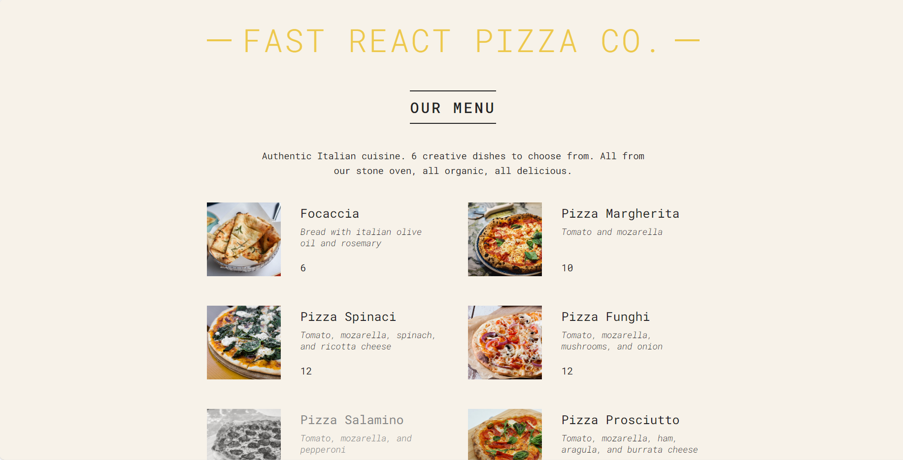

#  Fast React Pizza Co.

[Visitez le site en ligne]()

Date de début du projet : 12/02/2024  
Date de fin du projet : 15/02/2024

Ce projet est une page de menu pour le site d'un restaurant de pizzas nommé "Fast React Pizza Co.". Il a été développé en utilisant ReactJS pour mettre en pratique les concepts tels que les Props, le Rendering, le Destructuring Props et les Fragments.

## Fonctionnalités

- Affichage des différents menus de pizzas avec une photo, le nom de la pizza, les ingrédients et le prix.
- Les pizzas non disponibles sont affichées en gris pour indiquer leur indisponibilité.

## Déploiement

Le projet est déployé sur GitHub Pages à l'adresse suivante : [Lien vers le déploiement]()

## Instructions de développement

1. Clonez le dépôt GitHub sur votre machine locale.
2. Assurez-vous d'avoir Node.js installé sur votre machine.
3. Installez les dépendances en exécutant `npm install`.
4. Lancez l'application en exécutant `npm start`.
5. Accédez à l'application dans votre navigateur à l'adresse `http://localhost:3000`.

## Auteur

Ce projet a été développé par [Loa Gnadjou SOUMAHORO](https://github.com/LoaGnadjouSoumahoro).
